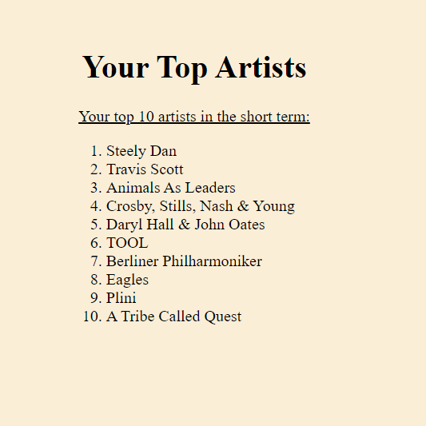
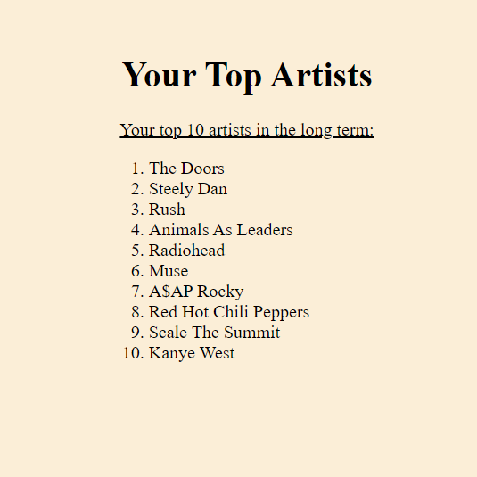
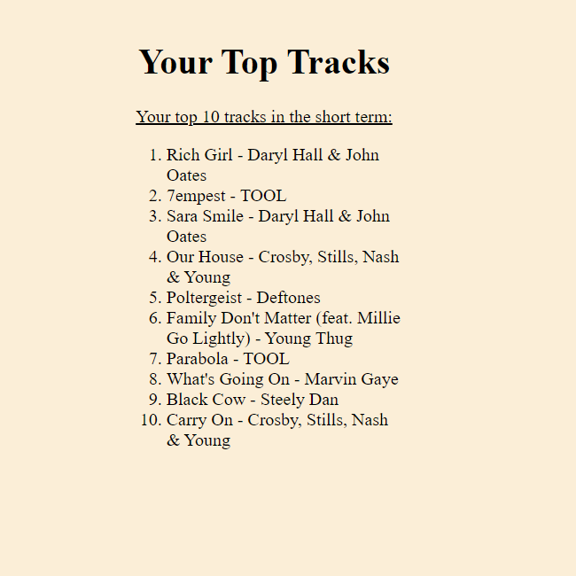
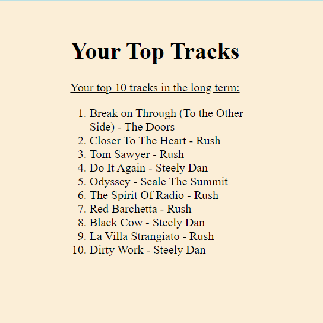
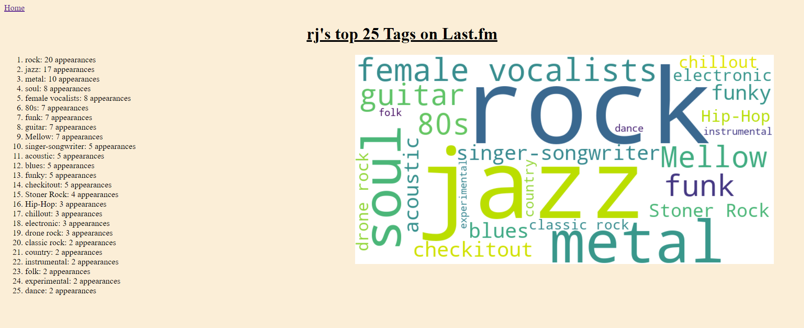

# Spotify/Last.fm Queries
[This Web App](https://rchakravarthy1.pythonanywhere.com/) provides point and click queries on spotify and last.fm data. See details below for installing locally. Use responsibly.

## Welcome to my Term Project!

Hello! And welcome to my term project's info site. For the functional web app, head over [to my app site](https://rchakravarthy1.pythonanywhere.com/). Also, feel free to check out my web development project [here](https://rchakravarthy1.github.io/webtech2023f/TPF/), in which I talk about some of my favorite genres, their history, and the notable artists behind them.

## The Big Idea

I started this project because I'm a music lover and this was a great way to integrate data, code, and music. I wanted to have a simple web app that would return some metrics based on some inputs. Sure, you can wait each year for Spotify wrapped to come out, but what about us impatient folks! For the past few years I've been using last.fm to scrobble my music data, so I utilized the last.fm and spotify APIs to create a set of functions that I find useful.

## Installing Locally

1. Download the latest version of the app.
2. Read [requirements.txt](/requirements.txt)
3. Install dependencies from requirements.txt
4. Obtain an API key and other tokens from [spotify](https://developer.spotify.com/documentation/web-api) and [last.fm](https://www.last.fm/api/rest)
5. Edit [config_template.py](/config_template.py) to include the necessary tokens
   1. Ensure your redirect URI matches the one in config.py. Stick with defaults like "http://localhost:5000"
6. Rename config_template.py to config.py
7. Run app.py and open locally in browser
8. Have fun!

## How to use the app

Head to the [app site](https://rchakravarthy1.pythonanywhere.com/) and explore some of the functions. Most of the functions are pretty intuitive to understand, but the last.fm functions are only really relevant for those familiar with last.fm, or those who have friends that use the service. If you're unfamiliar with last.fm or don't have an account of your own, try running some functions on these sample usernames.

* "rodude666": my personal last.fm username
* "NotLeet": one of my friends' username
* "RJ": A developer of the last.fm API

I'll explain the limitations in the next section, but this app works best standalone on a local device. The requirements are listed in [requirements.txt](/requirements.txt) From there, you can run app.py to explore the full functionality on your local port after grabbing an api key from [spotify](https://developer.spotify.com/documentation/web-api) and [last.fm](https://www.last.fm/api/rest) and setting them up in [config](/config_template.py)

## Limitations

Unfortunately in its current state, there are 3 functions that are not working properly in live deployment, however these are are functional locally, so I'll demonstrate the output of some of those functions in this info site.

### Spotify Top Artists

Due to issues with how the spotify authentication requires the user to interact with the site, I wasn't able to get these features working in deployment. Locally, after I authenticated my spotify account, I was able to access the data to show to you guys. Below is my top 10 artists in the short term:

And here's my top 10 artists in the long term:

I was certainly surprised to see the Chili Peppers sneak in there but those little surprises are what this project is all about!

### Spotify Top Tracks
A similar issue happens with the top tracks feature. Here's the data for my account when run locally. 

Top 10 tracks in the short term:

And here's my top 10 in the long term:

Of course Black Cow by Steely Dan makes both lists... it's timeless!

### Last.fm Top Tags

I actually couldn't isolate the issue for why this feature doesn't work in deployment, which is dissappointing considering I find it the most interesting. Here's a list of user RJ's top tags and the wordcloud that got generated from it. Note that the size of the words are based on count.

## Implementation and Structure

If you want to understand my app, the only files you need to look at are [main.py](/main.py) and [app.py](/app.py). I've done a couple applications in Flask before, so I decided to use it to build my web app. The spotify API is called, authenticated using a user token, and then the data is loaded into the functions directly, as opposed to the last.fm API which uses a URL to provide a JSON, which my functions then process and read into usable data. I tried to use as few external modules as possible without diminishing functionality. Each function works relatively independently from eachother, so hopefully the logic flow is easy to understand, but my the API documentation of the calls I'm using will do a far better job explaining what's going on behind the scenes.

## Final Notes
I encourage you to break my web app! If there's one thing I've learned from programming practice, it's that I can always use some help with QA. If you find an unmentioned error and let me know, I'll owe you a cookie. Once again, if you want to see more of my work, check out my [genre education website](https://rchakravarthy1.github.io/webtech2023f/TPF/). Stay tuned for more projects, and improvements to my current ones!
